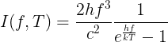
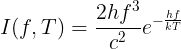

# emissivity-adjustment

Adjustment of emissivities in radiation-based temperature measurement.

This is useful in cases where the emissivity is unknown during measurement: temperatures recorded at a certain emissivity (e.g. set to 1) can be converted to a new emissivity.

The project is developed and maintained by the [**Model experiments group**](https://www.ikz-berlin.de/en/research/materials-science/section-fundamental-description#c486) at the Leibniz Institute for Crystal Growth (IKZ).

### Referencing
If you use this code in your research, please cite our article:

> TODO

## Usage

This repository provides two ways for emissivity adjustment. In the top of the scripts the following values have to be set:

- `t1`: the temperature that was measured (with wrong emissivity), in Kelvin
- `eps1`: the emissivity that was set during measurement, a value between 0 and 1
- `eps2`: the new emissivity (for which the temperature shall be computed), a value between 0 and 1
- the wavelength range of the measurement device:
  - `l1`: minimum wavelength, in meter
  - `l2`: maximum wavelength, in meter
 
 It is recommended to use the script `spectral_radiance.py`, because the computation is more accurate (even though it takes a little longer).

### Spectral radiance

In the script `spectral_radiance.py` the integral of the [spectral radiance function](https://en.wikipedia.org/wiki/Planck%27s_law)

is used to convert the measured temperature. The computation is performed as a fixed point iteration, it is most accurate.

### Wien approximation

The [Wien approximation](https://en.wikipedia.org/wiki/Wien_approximation) for the blackbody radiation spectrum

is accurate for short wavelength radiation and, thus, provides a simple way for adjustment of emissivities at high wavelengths. It is faster but, in general, less accurate than the integration of the spectral radiance. It is implemented in `wien_approximation.py`.

## Acknowledgements

[This project](https://www.researchgate.net/project/NEMOCRYS-Next-Generation-Multiphysical-Models-for-Crystal-Growth-Processes) has received funding from the European Research Council (ERC) under the European Union's Horizon 2020 research and innovation programme (grant agreement No 851768).

